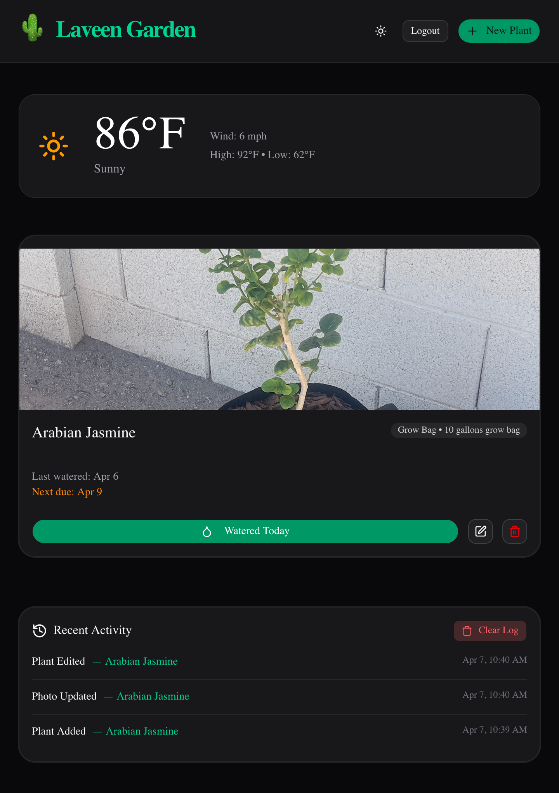
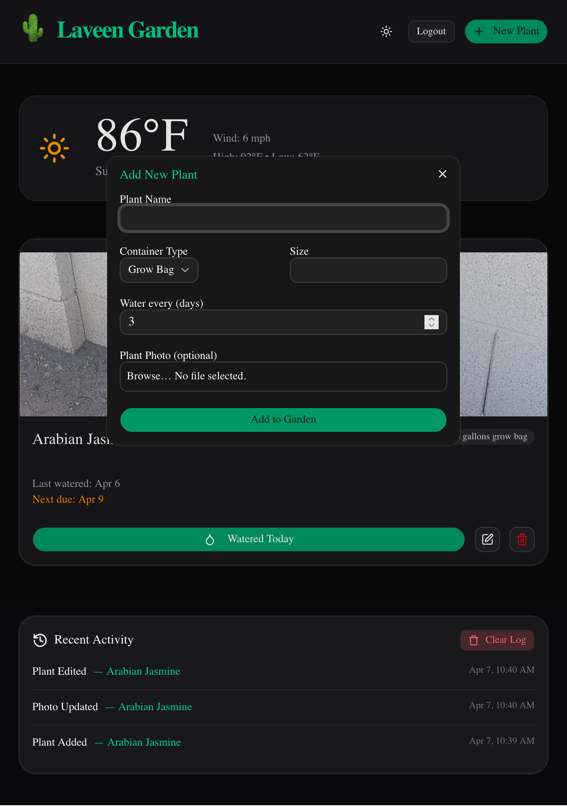
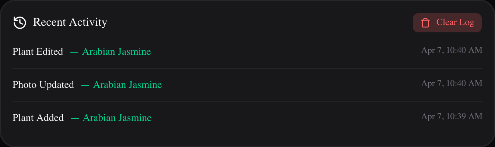
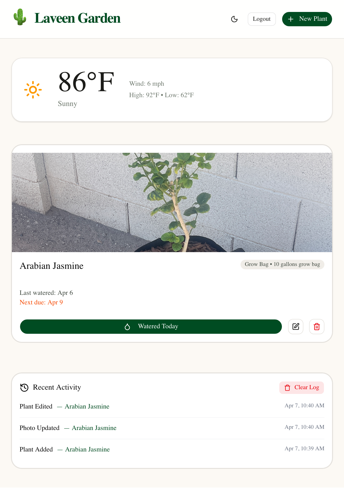

# Laveen Garden Tracker

A full-stack web app to track plants, watering schedules, photos, and activity in my desert garden (Laveen, AZ).

**Live Demo:** [https://laveen-garden-tracker.vercel.app](https://laveen-garden-tracker.vercel.app)  
**Tech Stack:** Next.js 16, TypeScript, Supabase (Postgres + Storage), Tailwind CSS, shadcn/ui

### Features
- Add, edit, and delete plants with container size and watering frequency
- Upload photos for each plant (stored in Supabase)
- Smart watering reminders (heat-aware for Arizona summers)
- Activity log showing who did what and when
- Dark mode toggle
- Shared password protection for me and my girlfriend

### What I Learned
- Building and deploying a full-stack Next.js application from scratch
- Working with Supabase for database management, file storage, and Row Level Security
- Handling file uploads and automatic photo cleanup
- Implementing secure shared password protection using environment variables (instead of hardcoding credentials)
- Using `git-filter-repo` to rewrite Git history and completely remove exposed credentials from all previous commits
- Responsive design and modern UI development with Tailwind CSS and shadcn/ui
- Git workflow, Vercel deployment, and proper management of secrets

### Screenshots

  
**Main dashboard with plants, weather widget, and activity log**

  
**Adding a new plant with photo upload**

  
**Recent activity log**

  
**Dark mode view**
